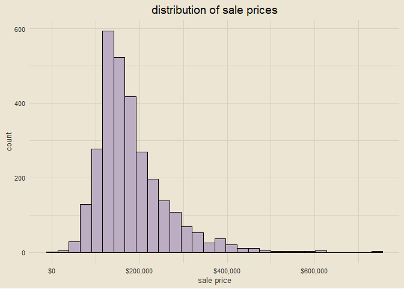
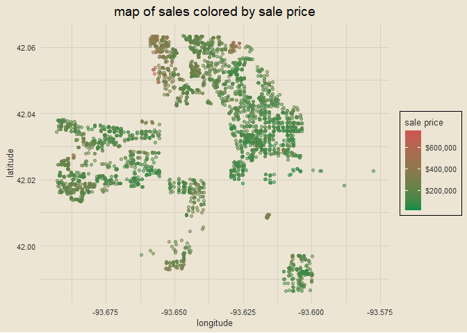
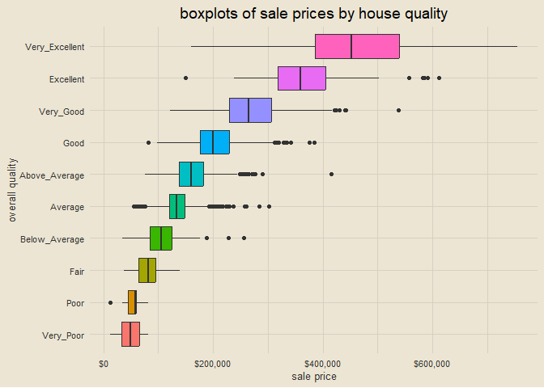
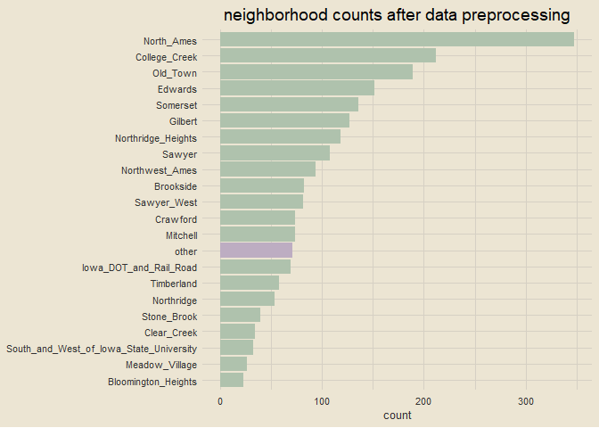
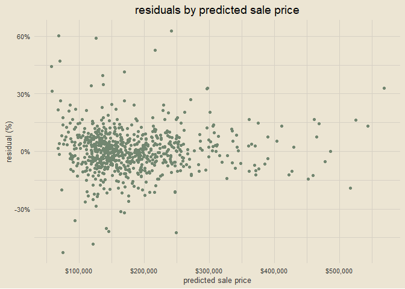

xgboost with tidymodels
================

### setup

``` r
library(tidyverse)
library(tidymodels)
library(AmesHousing)
library(janitor)
library(tvthemes)
options(scipen = 999)

theme_custom = theme_avatar() +
  theme(plot.title = element_text(hjust = 0.5),
        panel.grid.major = element_line(linewidth = 0.5, colour = "#D6D0C4"),
        panel.grid.minor = element_line(linewidth = 0.5, colour = "#D6D0C4"))

theme_set(theme_custom)

all_cores = parallel::detectCores(logical = F)
doParallel::registerDoParallel(cores = all_cores)
```

------------------------------------------------------------------------

### loading data

``` r
ames_data = clean_names(make_ames())
paste0("data dimensions: ", nrow(ames_data), " rows, ", ncol(ames_data), " columns")
```

    ## [1] "data dimensions: 2930 rows, 81 columns"

------------------------------------------------------------------------

### visualizing distribution of target variable (`sale_price`)

``` r
ames_data |>
  ggplot(aes(sale_price)) +
  geom_histogram(bins = 30, col = "black", fill = "#BDADC2") +
  scale_x_continuous(labels = scales::dollar_format()) +
  labs(x = "sale price", y = "count",
       title = "distribution of sale prices")
```

<!-- -->

------------------------------------------------------------------------

### visualizing sales geographically

``` r
ames_data |>
  ggplot(aes(longitude, latitude)) +
  geom_point(aes(col = sale_price), alpha = 0.5) +
  scale_color_continuous(low = "springgreen4", high = "indianred3",
                         labels = scales::dollar_format()) +
  labs(col = "sale price", title = "map of sales colored by sale price") +
  theme(legend.position = "right") 
```

<!-- -->

------------------------------------------------------------------------

### visualizing relationship between sale price and overall quality

``` r
ames_data |>
  ggplot(aes(overall_qual, sale_price)) +
  geom_boxplot(aes(fill = overall_qual), show.legend = F) +
  coord_flip() +
  scale_y_continuous(labels = scales::dollar_format()) +
  labs(y = "sale price", x = "overall quality",
       title = "boxplots of sale prices by house quality")
```

<!-- -->

------------------------------------------------------------------------

### data splitting

``` r
ames_split = initial_split(ames_data, prop = 0.75, strata = sale_price)
train_data = training(ames_split)
test_data = testing(ames_split)

paste0("training data: ", nrow(train_data), " rows, ", ncol(train_data), " columns")
```

    ## [1] "training data: 2197 rows, 81 columns"

``` r
paste0("testing data: ", nrow(test_data), " rows, ", ncol(test_data), " columns")
```

    ## [1] "testing data: 733 rows, 81 columns"

------------------------------------------------------------------------

### data preprocessing

``` r
pre_recipe = recipe(sale_price ~ ., data = train_data) |>
  # remove longitude and latitude as predictors
  update_role(longitude, latitude, new_role = "ID") |>
  # convert categorical variables to factor
  step_string2factor(all_nominal()) |>
  # combine low-frequency factor levels
  step_other(all_nominal(), threshold = 0.01) |>
  # remove predictors with zero variance
  step_nzv(all_nominal()) |>
  prep()

pre_recipe
```

    ## Recipe
    ## 
    ## Inputs:
    ## 
    ##       role #variables
    ##         ID          2
    ##    outcome          1
    ##  predictor         78
    ## 
    ## Training data contained 2197 data points and no missing data.
    ## 
    ## Operations:
    ## 
    ## Factor variables from ms_sub_class, ms_zoning, street, alley, lot_sha... [trained]
    ## Collapsing factor levels for ms_sub_class, ms_zoning, street, lot_shape, uti... [trained]
    ## Sparse, unbalanced variable filter removed street, alley, land_contour, utilities,... [trained]

------------------------------------------------------------------------

### example of `step_other()` preprocessing step

``` r
prepped_data = bake(pre_recipe, new_data = train_data)

prepped_data |>
  count(neighborhood) |>
  mutate(x = ifelse(neighborhood == "other", "other", "normal")) |>
  ggplot(aes(reorder(neighborhood, n), n)) +
  geom_col(aes(fill = x), show.legend = F) +
  scale_fill_manual(values = c("#AFC2AD", "#BDADC2")) +
  coord_flip() +
  labs(x = NULL, y = "count",
       title = "neighborhood counts after data preprocessing")
```

<!-- -->

------------------------------------------------------------------------

### creating cross-validation folds

``` r
cv_folds = vfold_cv(prepped_data, v = 8)
cv_folds
```

    ## #  8-fold cross-validation 
    ## # A tibble: 8 x 2
    ##   splits             id   
    ##   <list>             <chr>
    ## 1 <split [1922/275]> Fold1
    ## 2 <split [1922/275]> Fold2
    ## 3 <split [1922/275]> Fold3
    ## 4 <split [1922/275]> Fold4
    ## 5 <split [1922/275]> Fold5
    ## 6 <split [1923/274]> Fold6
    ## 7 <split [1923/274]> Fold7
    ## 8 <split [1923/274]> Fold8

------------------------------------------------------------------------

### creating xgboost model specification

``` r
xgb_model = boost_tree(trees = 1000, min_n = tune(), tree_depth = tune(),
           learn_rate = tune(), loss_reduction = tune()) |>
  set_engine("xgboost") |>
  set_mode("regression")

xgb_model
```

    ## Boosted Tree Model Specification (regression)
    ## 
    ## Main Arguments:
    ##   trees = 1000
    ##   min_n = tune()
    ##   tree_depth = tune()
    ##   learn_rate = tune()
    ##   loss_reduction = tune()
    ## 
    ## Computational engine: xgboost

------------------------------------------------------------------------

### specifying tuning grid

``` r
xgb_params = parameters(min_n(), tree_depth(), learn_rate(), loss_reduction())
xgb_params
```

    ## Collection of 4 parameters for tuning
    ## 
    ##      identifier           type    object
    ##           min_n          min_n nparam[+]
    ##      tree_depth     tree_depth nparam[+]
    ##      learn_rate     learn_rate nparam[+]
    ##  loss_reduction loss_reduction nparam[+]

------------------------------------------------------------------------

### setting up grid space

``` r
xgb_grid = grid_max_entropy(xgb_params, size = 60)
glimpse(xgb_grid)
```

    ## Rows: 60
    ## Columns: 4
    ## $ min_n          <int> 23, 15, 33, 37, 28, 27, 38, 23, 11, 38, 4, 28, 25, 14, ~
    ## $ tree_depth     <int> 6, 9, 4, 15, 1, 9, 2, 3, 8, 2, 10, 13, 11, 11, 14, 8, 8~
    ## $ learn_rate     <dbl> 0.0000136114623968, 0.0000003348722916, 0.0000000166421~
    ## $ loss_reduction <dbl> 0.7373390142736729, 0.0001056478601332, 0.8414052512280~

------------------------------------------------------------------------

### creating model workflow

``` r
xgb_wf = workflow() |>
  add_model(xgb_model) |>
  add_formula(sale_price ~ .)

xgb_wf
```

    ## == Workflow ====================================================================
    ## Preprocessor: Formula
    ## Model: boost_tree()
    ## 
    ## -- Preprocessor ----------------------------------------------------------------
    ## sale_price ~ .
    ## 
    ## -- Model -----------------------------------------------------------------------
    ## Boosted Tree Model Specification (regression)
    ## 
    ## Main Arguments:
    ##   trees = 1000
    ##   min_n = tune()
    ##   tree_depth = tune()
    ##   learn_rate = tune()
    ##   loss_reduction = tune()
    ## 
    ## Computational engine: xgboost

------------------------------------------------------------------------

### tuning the model

``` r
xgb_tuned = tune_grid(object = xgb_wf, resamples = cv_folds, grid = xgb_grid,
                      metrics = metric_set(rmse, rsq, mae), control = control_grid(verbose = T))

xgb_tuned
```

    ## Warning: This tuning result has notes. Example notes on model fitting include:
    ## preprocessor 1/1, model 17/60: Error in xgb.serialize(object$handle): std::bad_alloc
    ## preprocessor 1/1, model 18/60: Error in xgb.serialize(object$handle): std::bad_alloc
    ## preprocessor 1/1, model 40/60: Error in xgb.serialize(object$handle): std::bad_alloc

    ## # Tuning results
    ## # 8-fold cross-validation 
    ## # A tibble: 8 x 4
    ##   splits             id    .metrics           .notes          
    ##   <list>             <chr> <list>             <list>          
    ## 1 <split [1922/275]> Fold1 <tibble [180 x 8]> <tibble [0 x 1]>
    ## 2 <split [1922/275]> Fold2 <tibble [177 x 8]> <tibble [1 x 1]>
    ## 3 <split [1922/275]> Fold3 <tibble [180 x 8]> <tibble [0 x 1]>
    ## 4 <split [1922/275]> Fold4 <tibble [180 x 8]> <tibble [0 x 1]>
    ## 5 <split [1922/275]> Fold5 <tibble [180 x 8]> <tibble [0 x 1]>
    ## 6 <split [1923/274]> Fold6 <tibble [180 x 8]> <tibble [0 x 1]>
    ## 7 <split [1923/274]> Fold7 <tibble [180 x 8]> <tibble [0 x 1]>
    ## 8 <split [1923/274]> Fold8 <tibble [174 x 8]> <tibble [2 x 1]>

------------------------------------------------------------------------

### getting best hyperparameters

``` r
xgb_tuned |>
  show_best(metric = "rmse")
```

    ## # A tibble: 5 x 10
    ##   min_n tree_depth learn~1 loss_r~2 .metric .esti~3   mean     n std_err .config
    ##   <int>      <int>   <dbl>    <dbl> <chr>   <chr>    <dbl> <int>   <dbl> <chr>  
    ## 1    20          4  0.0651 2.16e+ 1 rmse    standa~ 23545.     8   1724. Prepro~
    ## 2     7          7  0.0198 1.62e- 5 rmse    standa~ 23802.     8   1547. Prepro~
    ## 3     6          5  0.0591 5.15e- 2 rmse    standa~ 23808.     8   1621. Prepro~
    ## 4     9         13  0.0198 1.58e-10 rmse    standa~ 24227.     8   1609. Prepro~
    ## 5    20          7  0.0636 3.92e- 7 rmse    standa~ 24627.     8   1816. Prepro~
    ## # ... with abbreviated variable names 1: learn_rate, 2: loss_reduction,
    ## #   3: .estimator

------------------------------------------------------------------------

### isolating and finalizing best performing hyperparameter values

``` r
xgb_best_params = xgb_tuned |>
  select_best("rmse")

xgb_model_final = xgb_model |>
  finalize_model(xgb_best_params)

xgb_model_final
```

    ## Boosted Tree Model Specification (regression)
    ## 
    ## Main Arguments:
    ##   trees = 1000
    ##   min_n = 20
    ##   tree_depth = 4
    ##   learn_rate = 0.0651161925638483
    ##   loss_reduction = 21.6442331803823
    ## 
    ## Computational engine: xgboost

------------------------------------------------------------------------

### evaluating model performance on training data

``` r
train_prediction = xgb_model_final |>
  fit(formula = sale_price ~ ., data = prepped_data) |>
  predict(new_data = prepped_data) |>
  bind_cols(prepped_data)

xgb_score_train = train_prediction |>
  metrics(sale_price, .pred) |>
  mutate(.estimate = round(.estimate, 3))

xgb_score_train
```

    ## # A tibble: 3 x 3
    ##   .metric .estimator .estimate
    ##   <chr>   <chr>          <dbl>
    ## 1 rmse    standard    5815.   
    ## 2 rsq     standard       0.995
    ## 3 mae     standard    4232.

------------------------------------------------------------------------

### evaluating model performance on testing data

``` r
test_processed = bake(pre_recipe, new_data = test_data)

test_prediction = xgb_model_final |>
  fit(formula = sale_price ~ ., data = prepped_data) |>
  predict(new_data = test_processed) |>
  bind_cols(test_data)

xgb_score = test_prediction |>
  metrics(sale_price, .pred) |>
  mutate(.estimate = round(.estimate, 3))

xgb_score
```

    ## # A tibble: 3 x 3
    ##   .metric .estimator .estimate
    ##   <chr>   <chr>          <dbl>
    ## 1 rmse    standard   22775.   
    ## 2 rsq     standard       0.923
    ## 3 mae     standard   14727.

------------------------------------------------------------------------

### evaluating predictions; no apparent trends

``` r
pred_resid = test_prediction |>
  mutate(resid_pct = (sale_price - .pred) / .pred) |>
  select(.pred, resid_pct)

pred_resid |>
  ggplot(aes(.pred, resid_pct)) +
  geom_point(col = "#728670") +
  labs(x = "predicted sale price", y = "residual (%)",
       title = "residuals by predicted sale price") +
  scale_x_continuous(labels = scales::dollar_format()) +
  scale_y_continuous(labels = scales::percent)
```

<!-- -->
